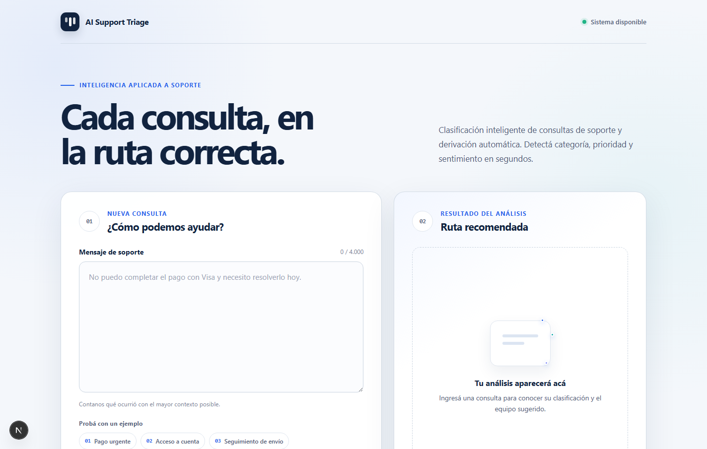
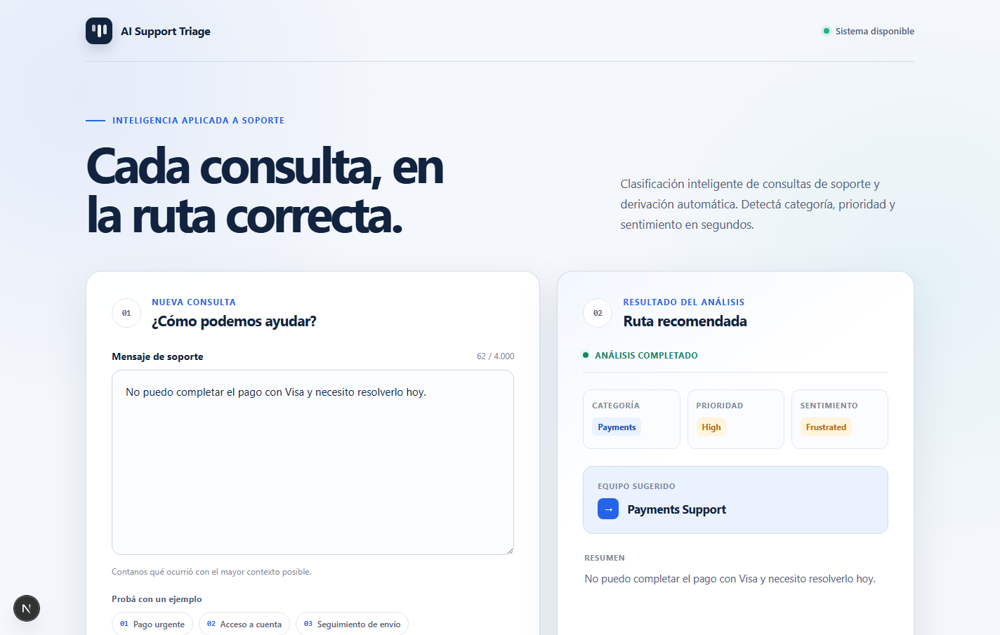
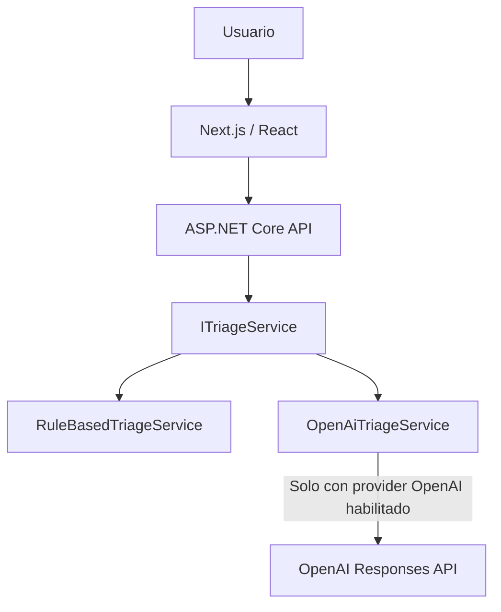

# AI Support Triage

AI Support Triage transforma consultas de soporte desestructuradas en información accionable para facilitar su priorización y derivación. El proyecto combina una API en .NET 8 con una interfaz web moderna y permite elegir entre análisis determinista local o integración opcional con OpenAI.

## Problema

Los equipos de soporte reciben consultas desestructuradas y necesitan entender rápidamente:

- qué tipo de problema es;
- qué urgencia tiene;
- cuál es el tono del usuario;
- qué ocurrió;
- qué equipo debería atenderlo.

## Solución

La aplicación recibe el mensaje de una consulta y devuelve un resultado estructurado con `Category`, `Priority`, `Sentiment`, `Summary` y `Suggested Team`.

Por ejemplo, para esta entrada:

> No puedo completar el pago con Visa y necesito resolverlo hoy.

El resultado conceptual es:

```text
Category: Payments
Priority: High
Sentiment: Frustrated
Suggested Team: Payments Support
Summary: El usuario no puede completar un pago con Visa y necesita resolverlo hoy.
```


## Capturas

### Estado inicial



### Análisis exitoso de Payments


## Arquitectura



El contrato `ITriageService` mantiene al controller independiente del motor de análisis seleccionado por configuración.

## Motores de análisis

### RuleBased

- Motor determinista y local.
- Provider predeterminado.
- No requiere servicios externos.
- Permite ejecutar, demostrar y evaluar el proyecto sin costos.

### OpenAI

- Integración opcional mediante OpenAI Responses API.
- Usa Structured Outputs con JSON Schema para obtener un contrato predecible.
- Requiere una API key propia, almacenada exclusivamente en el backend mediante .NET User Secrets.

La integración está implementada y cubierta por tests automatizados. La validación externa realizada alcanzó correctamente el proveedor, pero no se completó una inferencia real por falta de créditos en la cuenta utilizada durante el desarrollo.

## Stack

**Backend**

- .NET 8
- ASP.NET Core Web API
- OpenAI official .NET SDK
- xUnit

**Frontend**

- Next.js
- React
- TypeScript
- CSS nativo

**Otros**

- Structured Outputs
- JSON Schema
- Git / GitHub

## Decisiones técnicas

- `ITriageService` desacopla el controller del motor utilizado.
- `RuleBasedTriageService` ofrece desarrollo y demos deterministas sin dependencias externas.
- `OpenAiTriageService` encapsula la comunicación y validación del proveedor externo.
- Structured Outputs evita depender de respuestas de texto libre.
- La API key nunca llega al frontend.
- El provider se selecciona mediante configuración.
- No existe fallback silencioso entre OpenAI y RuleBased.
- `CancellationToken` se propaga a través del flujo asíncrono.
- `ProblemDetails` entrega errores sanitizados cuando falla el proveedor.

## Estructura del proyecto

```text
AI-Support-Triage/
├── backend/
│   └── AI.SupportTriage.Api/
├── frontend/
│   └── AI.SupportTriage.Web/
├── tests/
│   └── AI.SupportTriage.Tests/
├── docs/
│   └── screenshots/
├── global.json
└── README.md
```

## Ejecutar localmente

### Requisitos

- Visual Studio 2022 para la experiencia de un único Play
- .NET 8 SDK
- Node.js
- pnpm para instalar y gestionar las dependencias del frontend

La ruta principal usa `RuleBased`, por lo que no requiere una cuenta de OpenAI ni configuración de secretos.

### Un único Play en Visual Studio 2022

`AI.SupportTriage.Api` es el único startup project. Al presionar Play, el flujo es:

```text
Visual Studio
→ ASP.NET Core API
→ SpaProxy
→ npm run dev
→ Next.js
→ Chrome
→ http://localhost:3000
```

SpaProxy usa npm únicamente para ejecutar el script `dev`; pnpm continúa siendo el package manager del frontend y no existe `package-lock.json`. No es necesario iniciar frontend y backend manualmente.

Puertos de desarrollo:

- Frontend: `http://localhost:3000`
- Backend HTTP: `http://localhost:5173`
- Backend HTTPS: `https://localhost:7225`

### Preparación inicial

Instalar las dependencias una vez con pnpm:

```powershell
dotnet restore
Set-Location frontend/AI.SupportTriage.Web
pnpm install
```

Luego se puede usar Play en Visual Studio. Como alternativa, el mismo flujo coordinado puede iniciarse desde la raíz del repositorio con:

```powershell
dotnet run --project backend/AI.SupportTriage.Api/AI.SupportTriage.Api.csproj --launch-profile http
```

En ambos casos SpaProxy inicia Next.js; no debe ejecutarse otro servidor frontend en paralelo.

`frontend/AI.SupportTriage.Web/.env.development` define `NEXT_PUBLIC_API_BASE_URL=http://localhost:5173`. Es una configuración versionable de Development y no contiene secretos.

En Development no se fuerza la redirección HTTPS, de modo que Next.js puede consumir la API HTTP directamente. HTTPS continúa disponible en el puerto 7225 y, fuera de Development, la redirección HTTPS permanece habilitada.
### Configuración RuleBased

La configuración versionada en `backend/AI.SupportTriage.Api/appsettings.json` utiliza:

```json
{
  "Triage": {
    "Provider": "RuleBased"
  }
}
```

Esta es la configuración predeterminada y recomendada para evaluar el repositorio localmente.

### Configuración OpenAI opcional

Desde la raíz del repositorio, configurar la API key propia mediante .NET User Secrets:

```powershell
dotnet user-secrets set "OpenAI:ApiKey" "TU_API_KEY" --project backend/AI.SupportTriage.Api/AI.SupportTriage.Api.csproj
dotnet user-secrets set "Triage:Provider" "OpenAI" --project backend/AI.SupportTriage.Api/AI.SupportTriage.Api.csproj
```

La API key no debe incluirse en archivos versionados ni enviarse al frontend. Esta modalidad requiere créditos disponibles en la cuenta del proveedor. Para volver al motor local, establecer `Triage:Provider` en `RuleBased` o eliminar ese override de User Secrets.

## API

### `GET /api/health`

Comprueba la disponibilidad de la API.

### `POST /api/triage`

Solicitud:

```json
{
  "message": "No puedo completar el pago con Visa y necesito resolverlo hoy."
}
```

Respuesta:

```json
{
  "category": "Payments",
  "priority": "High",
  "sentiment": "Frustrated",
  "summary": "El usuario no puede completar un pago con Visa y necesita resolverlo hoy.",
  "suggestedTeam": "Payments Support"
}
```

## Tests

El proyecto cuenta con 64 tests automatizados que cubren contratos, enums, controllers, `RuleBasedTriageService`, `OpenAiTriageService`, registro y selección del provider, Structured Outputs, JSON inválido y errores del proveedor.

Los tests de OpenAI usan un cliente controlado y no realizan llamadas reales al servicio externo.

```powershell
dotnet test
```

## Seguridad

- La API key opcional se mantiene en el backend mediante .NET User Secrets.
- El frontend no recibe ni almacena credenciales del proveedor.
- Los errores externos se presentan como `ProblemDetails` sanitizados.
- La configuración separa explícitamente `RuleBased` y `OpenAI`.
- Los archivos `.env` privados permanecen ignorados; solo se versionan `.env.example` y la configuración pública `.env.development`.

## Alcance

Este proyecto de portfolio se enfoca en demostrar IA aplicada a una necesidad concreta de negocio, integración de un proveedor LLM, contratos estructurados, seguridad de secretos, testing y criterio de arquitectura.

Para mantener ese objetivo acotado, no incluye autenticación, persistencia, historial, una plataforma administrativa, RAG ni embeddings.

## Estado

El flujo completo está implementado y puede ejecutarse localmente con el provider `RuleBased`, sin costos ni servicios externos. La integración con OpenAI está disponible como opción configurable.
